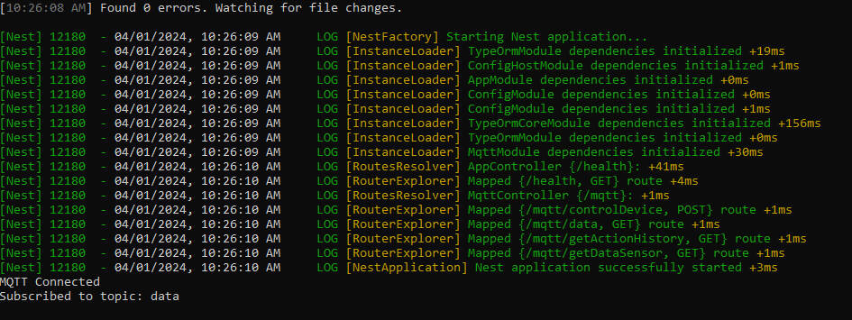
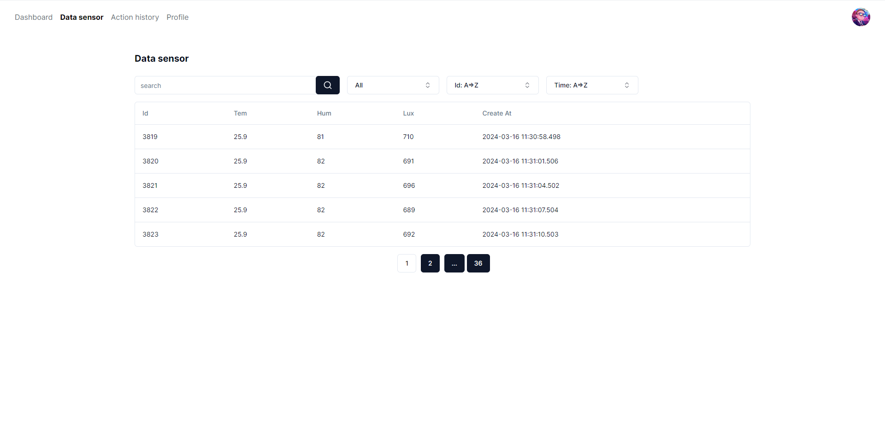
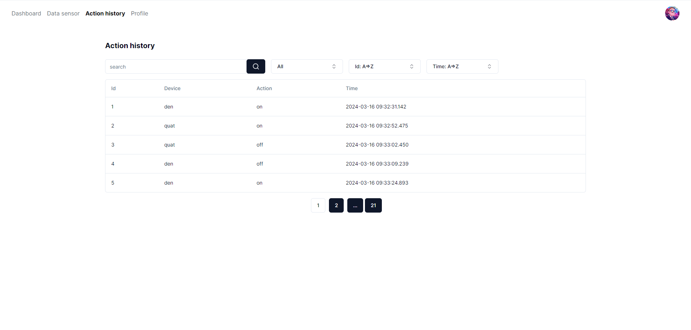

# Project IOT
### Table of contents

1. [Clone](#clone)
2. [Backend](#backend)
    - [Installation](#installation)
    - [Config](#config)
    - [Running](#running)
3. [Frontend](#frontend)
    - [Installation](#installation-1)
    - [Running](#running-1)
4. [Hardware](#hardware)
5. [API DOCS](#api-docs)
### Clone

```bash
$ npm clone https://github.com/Tu9L3/IOT.git
```

### Backend

---
### Installation
```bash
$ cd be
$ npm i
```
---
### Config
Create file `.env` from `.env.example`
```
DB_HOST = 'your host'
DB_PORT = 'your port'
DB_USERNAME = 'your username'
DB_PASSWORD = 'your password'
DB_DATABASE = 'your database'

MQTT_USERNAME = 'your broker username'
MQTT_PASSWORD = 'your broker password'
MQTT_URL = 'your broker url'
```

---
### Running
```bash
$ npm run start:dev
```
Terminal


---
### Frontend

---
### Installation
```bash
$ cd fe
$ npm i
```

---
### Running
```bash
$ npm run dev
```
Dashboard

Data sensor

Action history

---
### HARDWARE
1. Install Arduino
2. Config


```
ssid = 'your ssid'
password = 'your password'
mqtt_server = 'your server'
mqtt_username = 'your username'
mqtt_password = 'your password'
port = 'your port' (Ctrl + F: 1885)
```

### API DOCS
```
http://${your host}:${your port}/api-docs
```
